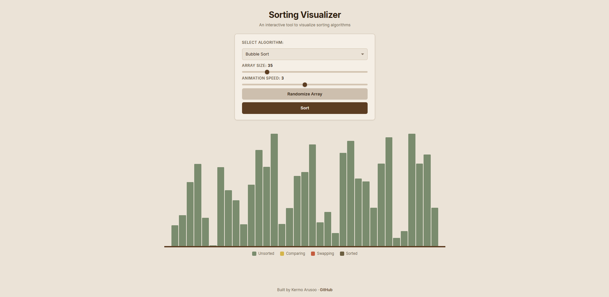

# Sorting Visualizer

A browser-based tool that brings sorting algorithms to life. Pick an algorithm, hit Sort, and watch bars rearrange themselves step by step with color-coded comparisons and swaps.

Built as a hobby project to explore algorithm visualization, async JavaScript, and DOM manipulation.

## Features

- **Three sorting algorithms** — Bubble Sort, Selection Sort, and Insertion Sort, each with distinct visual patterns
- **Adjustable speed** — control animation speed in real time, even mid-sort
- **Adjustable array size** — generate arrays from 20 to 100 elements
- **Color-coded steps** — green (unsorted), yellow (comparing), red-orange (swapping), dark olive (sorted/final position)
- **Stop & reset** — stop any sort mid-run and start fresh
- **Responsive layout** — works on desktop, tablet, and mobile

## How It Works

The app generates an array of random values and renders each as a vertical bar. When you start a sort, the algorithm runs step by step using `async/await` with small delays between each operation, so the browser has time to repaint the DOM and you can actually see what's happening.

Each algorithm has a visually different pattern:

- **Bubble Sort** — neighbors compare and swap, largest values "bubble" to the right
- **Selection Sort** — scans for the smallest value and places it at the front
- **Insertion Sort** — slides each element left into its correct position

## Live Demo

[View Live Demo](https://kermoarusoo.github.io/sorting-visualizer)

## Built With

- HTML
- CSS
- Vanilla JavaScript

No frameworks, no libraries, no build tools.

## Future Ideas

Some things I might add down the line:

- More algorithms (Merge Sort, Quick Sort, Heap Sort)
- A step counter and comparison counter to show algorithm efficiency
- Side-by-side mode to race two algorithms against each other
- Sound effects tied to bar heights (lower bars = lower pitch)
- A "step through" mode where you click to advance one step at a time

## Contributing

Want to add a new sorting algorithm? The structure makes it pretty straightforward:

1. Write an `async` function for your algorithm
2. Use the existing `swap()`, `highlightBars()`, `removeHighlight()`, and `markSorted()` helpers
3. Add `await sleep(getSpeed())` between steps for the animation
4. Add your algorithm to the `<select>` dropdown in `index.html`
5. Add the corresponding `else if` in the form submit listener

## License

MIT
